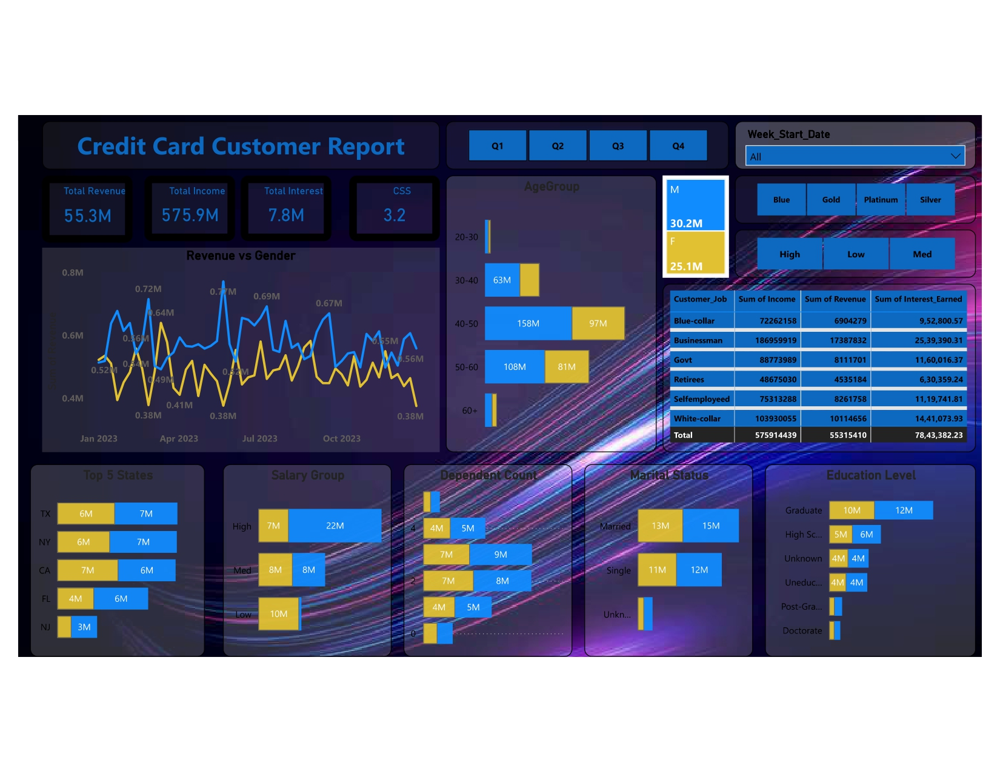
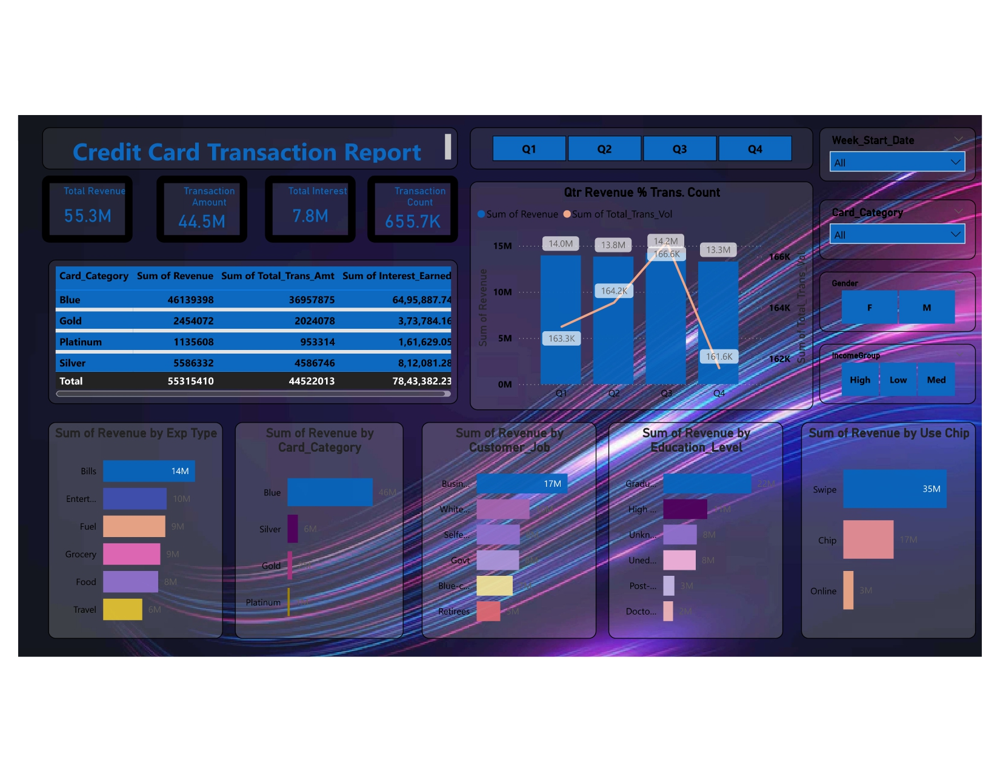

# Credit Card Analysis

## Table of Contents
- [Overview](#overview)
- [Problem Statement](#problem-statement)
- [Dataset Description](#dataset-description)
- [Data Cleaning and Preparation](#data-cleaning-and-preparation)
- [Data Analysis](#data-analysis)
- [Key Insights](#key-insights)
- [Actionable Strategic Insights](#actionable-strategic-insights)
- [KPIs and Metrics](#kpis-and-metrics)

---

## Overview
This repository contains a detailed analysis of **credit card customer and transaction data**.  

The goals are to:
- Identify key trends  
- Segment customers  
- Derive actionable insights to inform business strategy  

The final analysis is presented in an **interactive Power BI dashboard**.

---

## Problem Statement
The primary objective of this project is to analyze a credit card dataset to understand customer behavior and identify the key factors driving revenue. The analysis aims to answer the following questions:

- Who are the most profitable customer segments based on demographics like job, income, and education?  
- Which credit card products are the most popular and generate the most revenue?  
- What are the primary spending categories for customers?  
- How do transaction patterns and revenue vary over time (e.g., quarterly)?  
- What are the key drivers of interest income?  

These insights will help in **targeted marketing, improving customer retention, and making strategic business decisions**.

---

## Dataset Description
The analysis utilizes two datasets, linked by a common `Client_Num`.

### Customer Data (`customer.csv`)
Contains demographic information about each credit card holder.

**Key Columns:**
- `Client_Num`: Unique identifier for each customer  
- `Customer_Age`: Age of the customer  
- `Age_Group`: Age group (e.g., 20–30, 31–40)  
- `Gender`: M/F  
- `Dependent_Count`: Number of dependents  
- `Education_Level`: Highest education level  
- `Marital_Status`: Marital status  
- `state_cd`: State of residence  
- `Customer_Job`: Profession  
- `Income`: Annual income  
- `Income_Group`: Low / Medium / High  
- `Car_Owner`: Owns a car (yes/no)  
- `House_Owner`: Owns a house (yes/no)  
- `Personal_Loan`: Has personal loan (yes/no)  
- `Contact`: Contact method (cellular/unknown)  
- `Cust_Satisfaction_Score`: Customer satisfaction score (1–5)  

### Credit Card Transaction Data (`credit_card.csv`)
Contains detailed information about transactions and card usage.

**Key Columns:**
- `Client_Num`: Unique identifier (foreign key)  
- `Card_Category`: Card type (Blue, Silver, Gold, Platinum)  
- `Annual_Fees`: Annual card fee  
- `Week_Start_Date`: Transaction week start date  
- `Credit_Limit`: Card credit limit  
- `Total_Trans_Amt`: Total transaction amount  
- `Total_Trans_Vol`: Number of transactions  
- `Avg_Utilization_Ratio`: Credit utilization ratio  
- `Exp Type`: Expense category (Bills, Food, Travel, etc.)  
- `Interest_Earned`: Interest earned from customer  

---

## Data Cleaning and Preparation
Data was imported and transformed using **Power Query in Power BI**.

### Steps to Import Data
1. Navigate to **Get data → More → All → Folder → Connect**  
2. Provide the dataset folder path → Click **OK**  
3. Open **Power Query editor** with **Transform Data**  

### Calculated Fields (DAX)

**Income Group**
```arduino
Income Group = 
SWITCH(
    TRUE(),
    'customer'[Income] < 35000, "Low",
    'customer'[Income] >= 35000 && 'customer'[Income] < 70000, "Med",
    'customer'[Income] >= 70000, "High",
    "unknown"
)
```

**Age Group**
```arduino
Age_Group = 
SWITCH(
    TRUE(),
    'customer'[Customer_Age] < 30, "20-30",
    'customer'[Customer_Age] >= 30 && 'customer'[Customer_Age] < 40, "30-40",
    'customer'[Customer_Age] >= 40 && 'customer'[Customer_Age] < 50, "40-50",
    'customer'[Customer_Age] >= 50 && 'customer'[Customer_Age] < 60, "50-60",
    'customer'[Customer_Age] >= 60, "60+",
    "unknown"
)
```

**Week Num2**
```arduino
Week Num2 = WEEKNUM(credit_card[Week_Start_Date])
```

**Revenue**
```arduino
Revenue = 'credit_card'[Annual_Fees] + 
          'credit_card'[Total_Trans_Amt] + 
          'credit_card'[Interest_Earned]
```

**Current Week Revenue**
```arduino
Current_Week_Revenue = 
CALCULATE(
    SUM('credit_card'[Revenue]),
    FILTER(
        ALL(credit_card),
        'credit_card'[Week_Num2] = MAX('credit_card'[Week_Num2])
    )
)
```

**Previous Week Revenue**
```arduino
Previous_Week_Revenue = 
CALCULATE(
    SUM('credit_card'[Revenue]),
    FILTER(
        ALL(credit_card),
        'credit_card'[Week_Num2] = MAX('credit_card'[Week_Num2]) - 1
    )
)
```

## Data Analysis
The cleaned and merged dataset was used to build an **interactive Power BI dashboard**.  

### Dashboards Included
- **Customer Dashboard** → Demographics, income, occupation, education, states  
- **Transaction Dashboard** → Card types, expense categories, transaction methods, quarterly trends  

---

## Key Insights

### Customer Insights
- **Income & Occupation** → Businessmen are the top revenue contributors (**$17.4M**), White-collar professionals (**$10.1M**)  
- **Education** → Graduates (**$12M**) and Post-graduates (**$10M**)  
- **Marital Status** → Married customers (**$15M**) vs Single (**$12M**)  
- **Geography** → Top states: Texas, New York, California ($6–7M each)  
- **Gender** → Revenue fluctuates; one gender peaks at **$0.72M (Apr 2023)**  

### Transaction Insights
- **Card Type** → Blue card dominates (**$46.1M / 83% revenue**), Platinum (**$1.1M**)  
- **Expense Type** → Bills (**$14M revenue**)  
- **Transaction Method** → Swipe (**$35M**) dominates over Chip/Online  
- **Quarterly Trends** → Q3 highest revenue (**$14.2M, 166.6K transactions**), Q2 highest transactions (**168.5K, $14M**)  

---

## Actionable Strategic Insights
- **Target High-Value Segments** → Businessmen, White-collar professionals, Graduates  
- **Promote Bill Payments** → Cashback/rewards for utilities, rent, subscriptions  
- **Enhance Blue Card** → Tiered benefits to increase engagement  
- **Investigate Swipe Usage** → Analyze why Swipe dominates over Chip/Online  

---

## KPIs and Metrics
- **Total Revenue:** $55.3M  
- **Total Transaction Amount:** $44.5M  
- **Total Interest Earned:** $7.8M  




